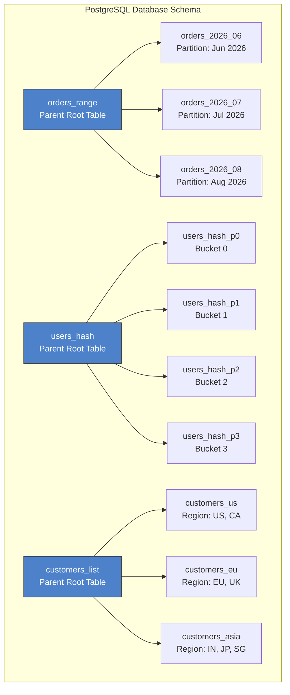
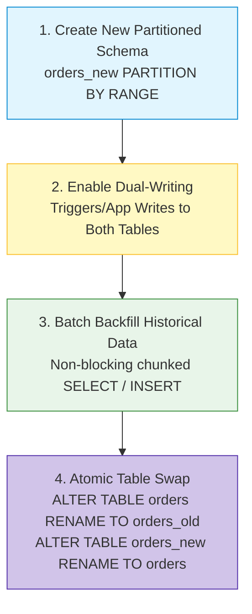

# Partitioning Setup

To learn how to use the files and configurations provided in this directory, please follow the detailed guide in this article:

[Scaling High-Volume Databases: A Complete Guide to PostgreSQL Table Partitioning with FastAPI](https://aps08.medium.com)

### PostgreSQL GUI Table Hierarchy

When viewing a partitioned PostgreSQL database in DBeaver, pgAdmin, or VS Code Extensions, the engine represents declarative partitioning as a parent-child inheritance hierarchy:



- **Parent Root Tables (`PARTITION BY ...`):** Only root tables appear in the top-level list.
- **Child Partition Tables (`PARTITION OF ...`):** Child partitions (`orders_2026_06`, `users_hash_p0`, `customers_us`) are nested directly beneath their respective parent root table.

### Verifying Partition Attachments via SQL

```sql
SELECT
    parent.relname AS parent_table,
    child.relname AS partition_name
FROM pg_inherits
JOIN pg_class parent ON pg_inherits.inhparent = parent.oid
JOIN pg_class child ON pg_inherits.inhrelid = child.oid
ORDER BY parent_table, partition_name;
```

### Production Partitioning & Migration Strategies

In production environments, hardcoding static date ranges inside application startup scripts is avoided.

#### Dynamic Partition Management (`pg_partman`)

`pg_partman` is an open-source PostgreSQL extension that automates partition lifecycles:

- **Pre-creation:** Automatically creates upcoming date partitions ahead of time via scheduled cron jobs.
- **Auto-Retention:** Detaches or drops historical partitions older than a set retention window (e.g., > 365 days).

#### Safety Net (`DEFAULT` Partition)

Prevents runtime application errors (`no partition found for row`) when inserting dates outside configured ranges:

```sql
CREATE TABLE orders_default PARTITION OF orders_range DEFAULT;
```

#### Zero-Downtime Migration to Partitioned Tables

To migrate a live, monolithic 500M row table without downtime:



1. **Create New Schema:** Define `orders_new PARTITION BY RANGE (order_date)`.
2. **Dual-Writing:** Use database triggers or application layer logic to write incoming data to both tables.
3. **Batch Backfill:** Backfill historical rows in small, non-blocking batches.
4. **Atomic Swap:** Swap table names atomically inside a single transaction block:
   ```sql
   BEGIN;
   ALTER TABLE orders RENAME TO orders_old;
   ALTER TABLE orders_new RENAME TO orders;
   COMMIT;
   ```

#### What is the difference between Database Partitioning and Database Sharding?

- **Partitioning (Single Database Instance):** Splitting a single large table into smaller physical child tables residing on the **same database server**. The database query planner transparently handles routing.
- **Sharding (Multi-Node / Horizontal Scaling):** Distributing database tables across **multiple independent database servers/nodes**. Requires application-level routing or a distributed coordinator (e.g., Citus, Vitess).

#### How does Partition Pruning work under the hood?

Partition pruning is an optimization technique where the database query planner inspects the query predicates (`WHERE` clause conditions) during planning/execution and discards partitions that cannot contain matching rows, eliminating unnecessary disk scans.

#### What happens if I insert a row whose partition key does not match any existing partition?

PostgreSQL will throw a runtime error: `ERROR: no partition of table "..." found for row`. To prevent this in production, either pre-create future partitions using tools like `pg_partman` or define a `DEFAULT` partition.

#### Can Primary Keys or Unique Constraints be placed on partitioned tables?

Yes, but in PostgreSQL, any `PRIMARY KEY` or `UNIQUE` constraint on a partitioned table **must include all partition key columns**. This constraint is necessary because PostgreSQL enforces uniqueness per physical partition.

**❌ Invalid Example (Will Fail):**
```sql
-- Partition key is `order_date`, but primary key only specifies `order_id`
CREATE TABLE orders (
    order_id INT,
    order_date DATE,
    amount NUMERIC,
    PRIMARY KEY (order_id) -- ERROR: UNIQUE constraint must include all key columns
) PARTITION BY RANGE (order_date);
-- Output: ERROR: UNIQUE constraint on partitioned table must include all key columns
```

**✅ Valid Example (Composite Primary Key):**
```sql
-- Primary key includes both `order_id` AND the partition key `order_date`
CREATE TABLE orders (
    order_id INT,
    order_date DATE,
    amount NUMERIC,
    PRIMARY KEY (order_id, order_date) -- VALID!
) PARTITION BY RANGE (order_date);
```

> **Why?** Each physical partition table manages its own B-Tree index. To guarantee global uniqueness without cross-checking all other physical partition indexes on every `INSERT`, PostgreSQL requires the partition key to be part of the unique index.


#### What is the difference between Horizontal Partitioning and Vertical Partitioning?

- **Horizontal Partitioning:** Splits a table by **rows** (e.g., putting Jan rows in one table and Feb rows in another).
- **Vertical Partitioning:** Splits a table by **columns** (e.g., separating frequently accessed columns like `email` from heavy binary/text columns like `profile_image_blob`).

### Q6: Does partitioning replace database indexes?

No. Partitioning and indexing complement each other. Partitioning narrows down the scan target to a small physical child table, and indexes within that specific partition make point lookups extremely fast.
